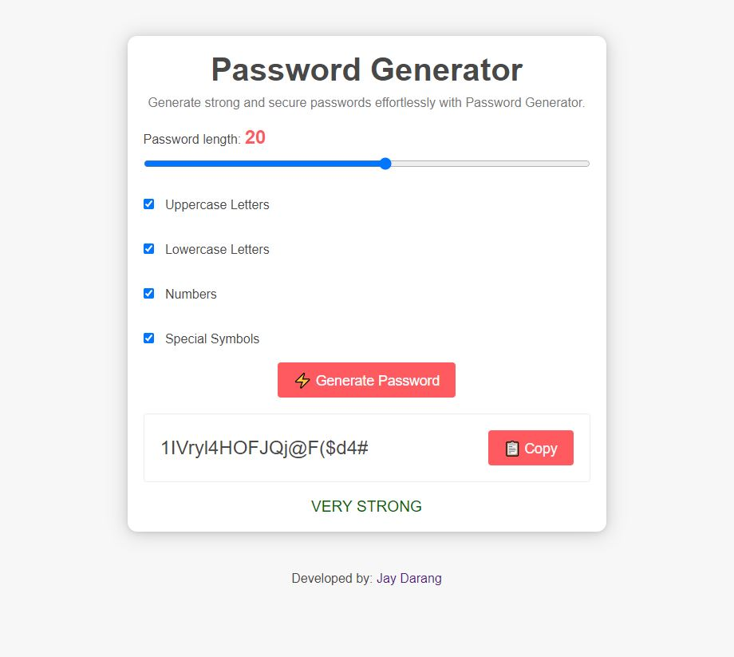

# Password Generator

This is a simple password generator app created as a solo project using vanilla JavaScript. It allows users to generate strong and secure passwords based on their specified criteria.

## Features

- Customizable password criteria:
  - Password length: Users can choose the desired length of the generated password.
  - Character types: Users can select whether to include lowercase letters, uppercase letters, numbers, and special characters in the password.
- Secure and random password generation: The app uses JavaScript's built-in cryptographic functions to generate strong and unpredictable passwords.
- User-friendly interface: The app provides a clean and intuitive user interface that allows users to easily interact with the password generation functionality.

## Usage

To use the Password Generator app, follow these steps:

1. Clone the repository or download the source code files.
2. Open the `index.html` file in a web browser.
3. Specify the desired password criteria by adjusting the options provided.
4. Click the "Generate Password" button to generate a password based on the chosen criteria.
5. The generated password will be displayed on the screen, and you can copy it to your clipboard for immediate use.

Feel free to experiment with different criteria and generate passwords that suit your needs.

## Technologies Used

The Password Generator app is developed using the following technologies:

- HTML: For creating the structure and layout of the app.
- CSS: For styling the user interface and making it visually appealing.
- JavaScript: For implementing the password generation functionality and handling user interactions.

## Compatibility

The app is designed to run on modern web browsers with JavaScript support. It should work on the latest versions of popular browsers such as Google Chrome, Mozilla Firefox, and Microsoft Edge.

## Contributing

This is a solo project, but if you have any suggestions, feedback, or bug reports, feel free to open an issue or submit a pull request on the GitHub repository.

## License

The Password Generator app is open source and released under the [MIT License](LICENSE). Feel free to modify, distribute, and use the code as per the terms of the license.
